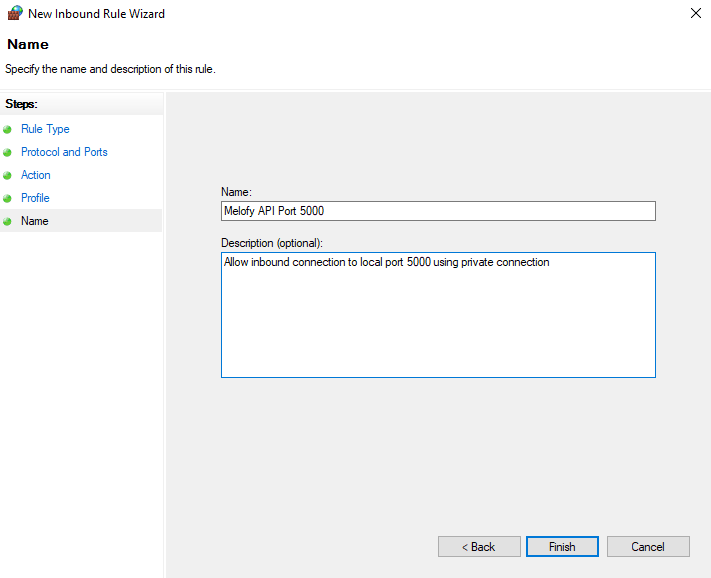

# Melofy API

An API in Python for generating melody from supplied audio file link.

</br>

## Prerequisites

In order to run this API, you need to install the following software first:

+ [Anaconda](https://www.anaconda.com/products/individual#Downloads)
+ [Git](https://git-scm.com/downloads)
+ [Ngrok](https://ngrok.com/download)

</br>

## API Endpoints

+ `/`

  A route to the homepage
  
  </br>
  
  **Example using curl command in Windows CMD (GET Request)**
  ```
  curl http://melofyapi.ap.ngrok.io
  ```
  
  </br>
  
+ `/generate`

  A route to generate melody from supplied audio file link
  
  </br>
  
  **Example using curl command in Windows CMD (POST Request)**
  ```
  curl -i -X POST -H "Content-Type:application/json" -d "{\"audio_file_link\": \"https://melofyapi.blob.core.windows.net/melofy-api-input/twinkle_twinkle_little_star.wav\" }" http://melofyapi.ap.ngrok.io/generate
  ```
  
</br>

## Deploy

</br>

### Deploy Flask app locally

</br>

1. Clone GitHub repository
```
git clone https://github.com/ariessa/melofy-api.git
```

2. Create new conda environment named `snakes` that contains Python 3.7
```
conda create -n snakes python=3.7
```

3. Activate new environment
```
conda activate snakes
```

4. Use pip to install packages
```
pip install flask gunicorn magenta azure-storage-blob audio-to-midi timidity
```

5. Run flask app
```
flask run
```

Congratulations, you just run the Flask app locally!

</br>


### Expose Local Flask App to the Internet

</br>

1. Enable incoming traffic for port `5000`. This is done by navigating to Control Panel> System and Security > Windows Defender Firewall > Advanced Settings


</br>

2. In Advanced Settings, click on Inbound Rules

</br>

3. After clicking Inbound Rules, click on New Rules in the Action column


</br>

4. In New Inbound Rule Wizard, select Rule Type as Port and click Next


</br>

5. In New Inbound Rule Wizard, apply rule to TCP and set specific local port to 5000 and click Next


</br>

6. In New Inbound Rule Wizard, specify action to Allow the connection and click Next


</br>

7. In New Inbound Rule Wizard, specify profile for which rule applies to Private


</br>

8. Still in New Inbound Rule Wizard, specify name to Melofy API Port 500 and description to Allow inbound connection to local port 5000 using private connection and click Finish



</br>

9. Check New Inbound Rule in the list of Inbound Rules


Congratulations, you just exposed local port 5000 to the Internet!

</br>

### Start Ngrok

</br>

**Basic Command**

</br>

Expose a web server on port 5000 of your local machine to the Internet
```
ngrok http 5000
```

</br>

**Advanced Commands**

</br>

Expose a web server on port 5000 of your local machine to the Internet, set region to Asia Pasific, and subdomain to melofyapi
```
ngrok http -region=ap -hostname=melofyapi.ap.ngrok.io 5000
```

</br>

Congratulations, you can now access the API at `http://melofyapi.ap.ngrok.io`!


